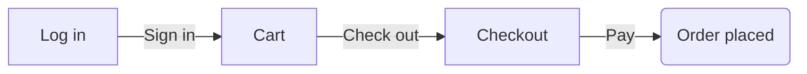
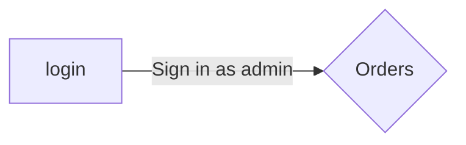

# Journeys: saved carts

One flowchart per user type. Screen IDs repeat where the same screen recurs.

```mermaid
flowchart LR
    %% Shopper
    login[Log in] -->|Sign in| cart[Cart]
    cart -- Check out --> checkout[Checkout]
    checkout -->|Pay| done(Order placed)
```

```mermaid
flowchart LR
    %% Admin: the same login screen, then the order list, a terminal screen
    login -->|Sign in as admin| orders{Orders}
```
